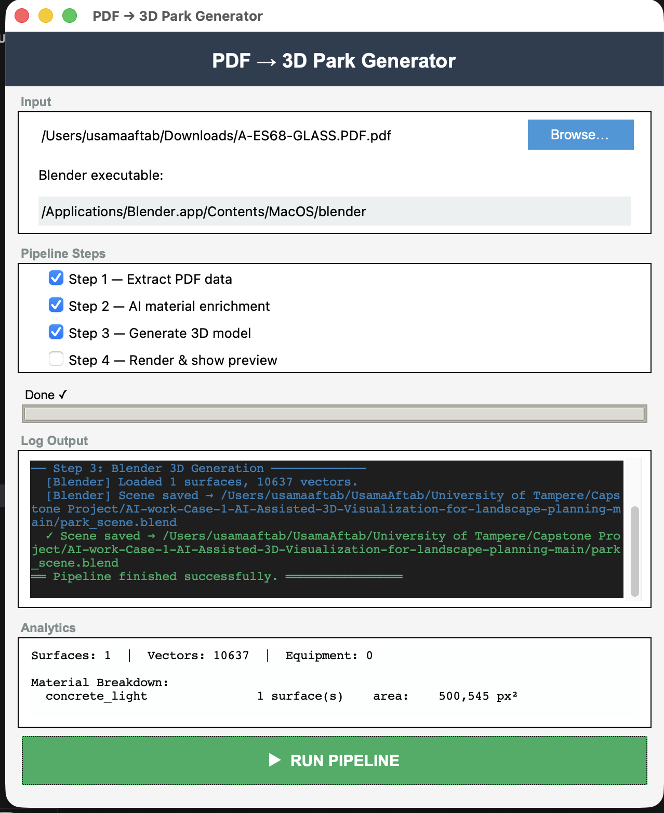

# PDF → 3D Park Generator

Turns a 2D playground/park architectural PDF into a rendered 3D scene. The
pipeline parses filled surfaces and equipment markers out of the PDF, uses
Google Gemini to classify each surface into a real-world material (grass,
safety rubber, sand, asphalt, etc.), then builds and renders a solid 3D
model of the whole layout in Blender — all driven from a desktop GUI.

<!-- Drop a screenshot or GIF of the GUI / rendered output here, e.g.: -->


## Pipeline

```
PDF  →  [1] Extract  →  [2] AI Classify  →  [3] Build 3D  →  [4] Render/Preview
                              (Gemini)          (Blender)
```

| Stage | File | What it does |
|---|---|---|
| 1. Extract | `src/pdf_extractor.py` | Parses the PDF with PyMuPDF: pulls filled polygons as "surfaces" (color + area), vector strokes, and numbered equipment markers matched against the legend text. Writes `park_output.json`. |
| 2. Enrich | `src/ai_enricher.py` | Sends each surface's color + area to Gemini for material classification (`grass_lush`, `safety_rubber_red`, `fine_sand`, …). Falls back to rule-based color heuristics if the API is unavailable or a call fails. |
| 3. Build | `src/blender_JSON_to_3D.py` | Runs headless inside Blender. Turns each surface into a solidified, UV-unwrapped mesh with a procedural PBR material (noise-driven bump maps, a glossy mix shader for water), and vector strokes into beveled curves. |
| 4. Render | (same file, optional flag) | Auto-frames the camera on the full scene, adds sun + fill lighting, and renders a lit preview PNG. |
| GUI | `src/UI.py` | Tkinter front end: pick a PDF, toggle which stages run, watch a color-coded live log and progress bar, view analytics (material breakdown, surface/vector/equipment counts), and pop open the rendered preview. |

## Project structure

```
.
├── README.md
├── requirements.txt
├── .env.example
├── .gitignore
└── src/
    ├── UI.py                    # GUI entry point — run this
    ├── pdf_extractor.py         # Stage 1
    ├── ai_enricher.py           # Stage 2
    └── blender_JSON_to_3D.py    # Stages 3–4 (runs inside Blender, not plain Python)
```

Generated output (`park_output.json`, `park_scene.blend`, `model_preview.png`)
is written to the project root and is git-ignored — it's a build artifact,
not source.

## Setup

Requires **Python 3.10+** and **Blender 4.x** (installed separately —
Blender is not a pip package: [blender.org/download](https://www.blender.org/download/)).

```bash
git clone https://github.com/usamaaftab982/pdf-to-3d-park-generator.git
cd pdf-to-3d-park-generator

python3 -m venv venv
source venv/bin/activate        # Windows: venv\Scripts\activate
pip install -r requirements.txt

cp .env.example .env
# then edit .env and add your Gemini API key
# (free at https://aistudio.google.com/apikey)
```

## Running

```bash
python3 src/UI.py
```

1. **Browse…** to select a PDF.
2. Confirm the **Blender executable** field points at your install (it
   auto-detects common macOS/Linux/Windows paths, or set it manually).
3. Toggle pipeline stages as needed — Step 4 (render preview) is optional.
4. Click **▶ RUN PIPELINE** and watch the log / progress bar / analytics
   panel update live.

Or run each stage independently from the CLI:

```bash
python3 src/pdf_extractor.py          # writes park_output.json
python3 src/ai_enricher.py            # enriches it in place
blender --background --python src/blender_JSON_to_3D.py -- --render-preview
```

## Notes / known limitations

- Spatial filters (`AREA_THRESHOLD`, `X_LIMIT`, `Y_LIMIT` in
  `pdf_extractor.py`) are tuned for a specific PDF layout convention
  (legend/title block in the bottom-right). Adjust these constants for
  PDFs with a different layout.
- AI classification needs an active Gemini API key and quota; without one,
  the pipeline still completes using the rule-based color-heuristic
  fallback, just with lower material accuracy.
- Blender must run with `--background` (headless) for the GUI's
  subprocess call to work reliably outside an interactive session.
- On macOS, native Tkinter buttons (`tk.Button`) ignore custom `bg`/`fg`
  colors under the Aqua theme — `UI.py` works around this with
  `ttk.Button` + a `clam`-themed style.

## Possible next steps

- Batch mode: process a folder of PDFs without the GUI.
- Cache Gemini responses by surface color + area so re-runs on the same
  PDF don't re-spend API calls.
- Replace the single hardcoded `MODEL` constant in `ai_enricher.py` with
  a small ordered fallback list, so a future model retirement degrades
  gracefully instead of silently dropping to rule-based classification.
- Unit tests for the color-heuristic fallback and the JSON schema passed
  between pipeline stages.

## Tech stack

Python · PyMuPDF · Google Gemini API · Blender (Python API / `bpy`) · Tkinter